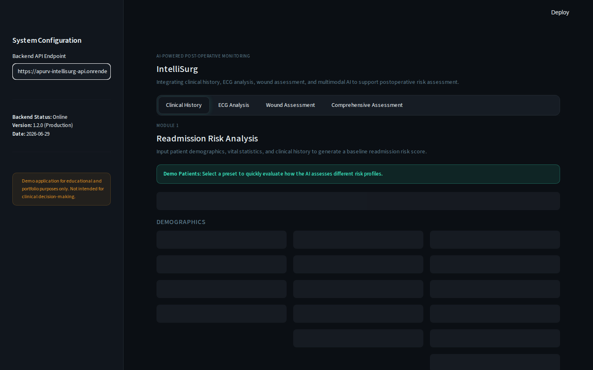
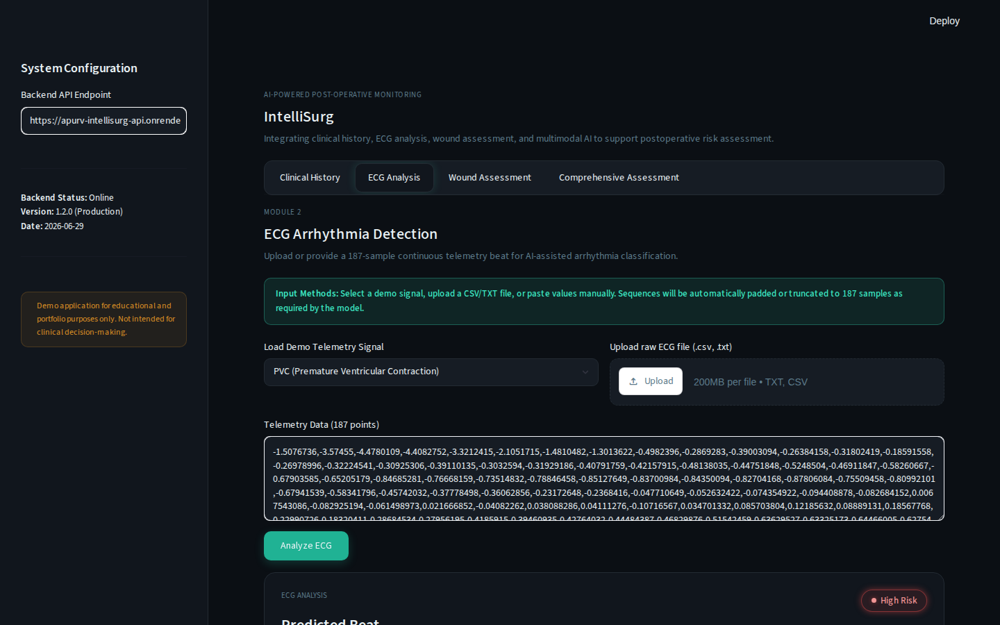
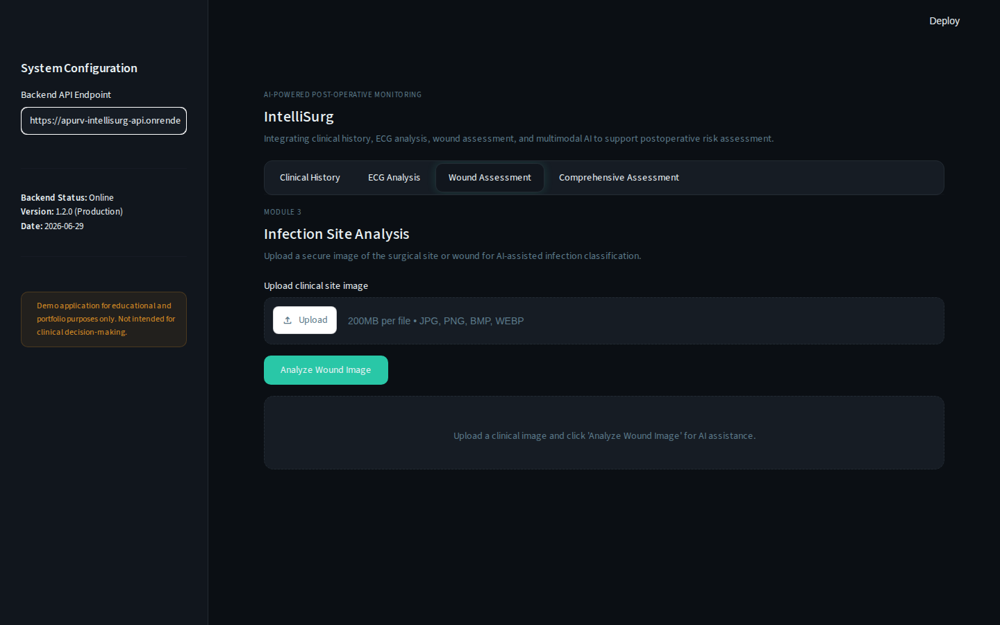
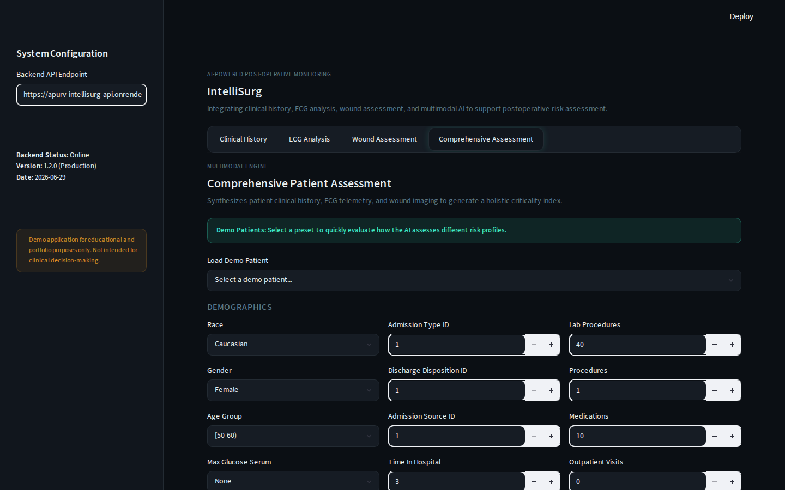

# 🏥 IntelliSurg

<div align="center">

### AI-Powered Post-operative Patient Monitoring System

*A multi-model healthcare AI prototype integrating ANN, RNN, CNN and Fusion AI into a unified clinical dashboard.*

[](https://intellisurg-ai.streamlit.app/)

[](https://apurv-intellisurg-api.onrender.com)


</div>

---

## 🌐 Live Deployment

### 🚀 Frontend (Streamlit)

https://intellisurg-ai.streamlit.app/

### ⚡ Backend API (Render)

https://apurv-intellisurg-api.onrender.com

---

# 📖 Overview

IntelliSurg is an AI-powered clinical decision support prototype designed to demonstrate how multiple machine learning models can work together to assist in post-operative patient monitoring.

The system combines structured clinical data, ECG signals and wound images into a single dashboard capable of generating an overall patient assessment.

This project was developed as an educational demonstration of applied AI in healthcare.

---
# 🚀 Highlights

- 🧠 Multimodal AI system integrating ANN, CNN, RNN and Fusion AI
- ❤️ Real ECG5000 dataset integration for ECG beat classification
- 🏥 Professional clinical dashboard built with Streamlit
- ⚡ FastAPI backend with REST APIs and Pydantic validation
- 📊 Interactive ECG waveform visualization and confidence analysis
- 🩹 AI-powered wound infection detection
- 📈 Comprehensive multimodal patient assessment report
- ☁️ Deployed using Streamlit Community Cloud and Render

---


# ✨ Features

### 🧠 ANN — Readmission Risk Prediction

* Predicts post-operative readmission risk
* Interactive probability visualization
* Clinical feature input form

---

### ❤️ RNN — ECG Beat Classification

* 187-point ECG signal classification
* Interactive ECG waveform visualization
* Beat probability distribution
* Confidence estimation

---

### 🩹 CNN — Wound Infection Detection

* Medical wound image classification
* Image upload interface
* Infection confidence prediction

---

### 📊 Fusion AI Dashboard

Combines outputs from all models to generate

* Overall patient criticality score
* Risk badge
* ANN summary
* ECG summary
* Wound assessment

---

# 📸 Screenshots

## ANN Readmission Prediction



---

## ECG Beat Classification



---

## Wound Classification



---

## Fusion Dashboard



---

# 🏗 System Architecture

```text
               Patient Data
                     │
     ┌───────────────┼───────────────┐
     │               │               │
 Clinical Data     ECG Signal     Wound Image
     │               │               │
     ▼               ▼               ▼
    ANN             RNN             CNN
     │               │               │
     └───────────────┼───────────────┘
                     ▼
              Fusion AI Engine
                     ▼
          Clinical Dashboard (Streamlit)
```

---

# ⚙️ Tech Stack & Engineering Practices

## Engineering Practices

* **Modular FastAPI Architecture:** Clean separation of concerns with distinct routers, schemas, and core ML inference logic.
* **Robust Data Validation:** Utilizing `Pydantic` models to strictly validate API payloads and ensure safe data handling.
* **Production-Ready Logging:** Implementing standard Python `logging` for detailed server-side error tracking and system observability.
* **Asynchronous Handling:** Utilizing FastAPI's `async/await` for efficient file I/O handling during image uploads.
* **Strict Type Hinting:** Enhancing maintainability and developer experience via comprehensive Python type annotations.
* **Polished UI/UX:** Leveraging Streamlit with custom CSS to build a highly responsive, professional clinical dashboard.

## Frontend

* Streamlit
* Plotly

## Backend

* FastAPI
* Uvicorn
* Pydantic

## Machine Learning

* TensorFlow / Keras
* Artificial Neural Networks (ANN)
* Recurrent Neural Networks (RNN)
* Convolutional Neural Networks (CNN)
* Scikit-Learn (Data Preprocessing)

## Languages

* Python (3.11+)

---
# 📊 Datasets

The project integrates multiple datasets to demonstrate a multimodal clinical AI workflow.

| Model | Dataset |
|--------|---------|
| ANN | Post-operative clinical tabular dataset |
| RNN | ECG5000 dataset |
| CNN | Surgical wound image dataset |

# 📂 Project Structure

```text
IntelliSurg-App
│
├── backend
│   ├── core
│   ├── metadata
│   ├── models
│   ├── routers
│   ├── scalers
│   ├── schemas
│   └── requirements.txt
│
├── frontend
│   ├── app.py
│   ├── theme.py
│   └── start_frontend.ps1
│
├── screenshots
│   ├── ann.png
│   ├── rnn.png
│   ├── cnn.png
│   └── fusion.png
│
└── README.md
```

---
# 📚 Documentation

A complete engineering handbook describing the project architecture, machine learning pipeline, backend APIs, frontend design, deployment workflow, and implementation details is available at:

docs/IntelliSurg_Engineering_Handbook.md
# 🚀 Getting Started

Clone the repository

```bash
git clone https://github.com/apurvaanandbit1-sys/IntelliSurg-App.git
```

Install backend dependencies

```bash
pip install -r backend/requirements.txt
```

Start backend

```bash
cd backend
.\start_backend.ps1
```

Start frontend

```bash
cd frontend
.\start_frontend.ps1
```

Open

```
http://localhost:8501
```

---

# 🎯 Future Improvements

* User authentication
* Patient database integration
* Real-time ECG streaming
* Explainable AI visualizations
* Electronic Health Record integration
* PDF report generation
* Cloud deployment
* Docker support
* CI/CD pipeline

---

# ⚠️ Disclaimer

This project was developed for educational, research and portfolio purposes.

It is **not intended for clinical diagnosis or real-world medical decision-making.**

---

# 👨‍💻 Author

### Apurv Anand

B.Tech Computer Science Engineering

Birla Institute of Technology, Mesra

GitHub:

https://github.com/apurvaanandbit1-sys

---

<div align="center">

### ⭐ If you found this project interesting, consider giving it a star.

</div>
